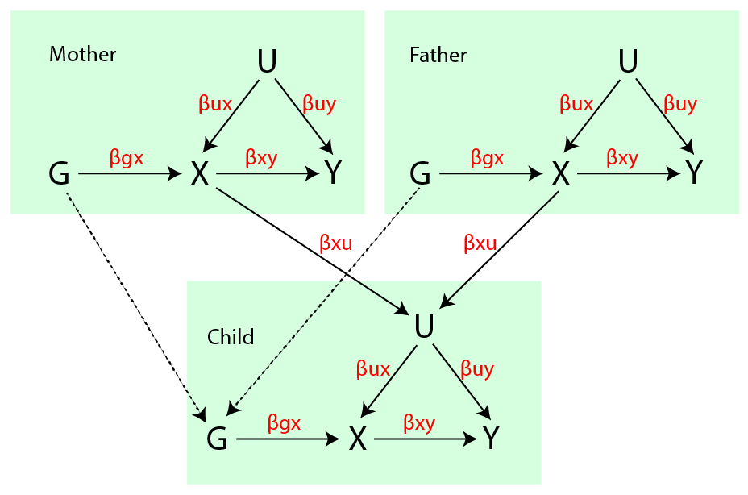

```{r, echo=FALSE, cache=FALSE, warning=FALSE}

suppressPackageStartupMessages(library(knitr))
suppressPackageStartupMessages(library(dplyr))
suppressPackageStartupMessages(library(ggplot2))
suppressPackageStartupMessages(library(tidyr))
suppressPackageStartupMessages(library(gridExtra))
opts_chunk$set(warning=FALSE, message=FALSE, cache=TRUE, echo=FALSE)

```




## Simulation of genotypes

Create $n$ mothers and fathers. They are unrelated. Each mother-father pair has 2 children. All individuals have genomes of 90 SNPs. Calculate IBD at each locus for each sibling pair. The distribution of IBD across the 90 SNPs is $N(\mu = 0.5, \sigma=0.037)$, as per theory, because there are on average 90 recombination events separating siblings. Hence, we are assuming each SNP has an effect and that all effects are independent.

## Dynastic effects on phenotype

See Figure 1. Parents have confounders $u$, exposure $x$ and outcome $y$ phenotypes. The confounder influences $x$ and $y$ by some effect $\beta_{ux}, \beta_{uy}$, and $x$ influences $y$ with $\beta_{xy}$.

The children have the same setup, except the parent's $x$ values influence the children's $u$ values also, with effect $\beta_{xu}$. This represents the dynastic effect.

The genetic influence of each of the 90 SNPs on $x$ amounts to explaining $V_{gx}$ of the variance in $x$. There is no pleiotropy.


\newpage

## Statistical models

### Standard MR using unrelateds

Use just one sibling from each family and perform MR as usual using IVW. This involves obtaining the SNP-exposure association for each of the 90 SNPs; the SNP-outcome association for each of the 90 SNPs, and estimating the slope underlying the relationship using inverse squared standard errors for weights.

### $D^2$ using siblings

The SNP-exposure estimates are performed within family. e.g. For SNP j

$$
(x_{i1} - x_{i2})^2 = \beta_{xj} \hat{\pi}_{ij} + e_{ij}
$$

and similarly the SNP-outcome estimates are obtained as

$$
(y_{i1} - y_{i2})^2 = \beta_{yj} \hat{\pi}_{ij} + e_{ij}
$$

The $\beta_{xj}$ and $\beta_{yj}$ estimates are then used in a standard IVW framework to obtain the causal effect.

Note that here $\hat{\pi}$ can represent locus-specific IBD estimates, IBS (weighted by allele frequency) or unwerighted IBS (simply the count of alleles in common).

### $S^2$ using siblings

Identical to the $D^2$ except the LHS of the equation is replaced with $(y_{i1} + y_{i2})^2$.


### $D^2 + S^2$ using siblings

Following from Visscher and Hopper 2001 this approximates the maximum likelihood estimate of the within-family linkage analysis by meta-analysing the $D^2$ and $S^2$ results of each SNP-exposure and SNP-outcome estimate. The results are subsequently used to estimate the causal effect in the standard IVW framework.

$$
\begin{aligned}
w &= \frac{\frac{1}{v_D}}{\frac{1}{v_D} + \frac{1}{v_S}} \\
b_{DS} &= \frac{1}{2}((1 - w) b_S - w b_D) \\
v_{DS} &= \frac{1}{4} w v_D
\end{aligned}
$$

### Simple sibling model

The above sibling methods are forms of linkage analysis. 

Here the effect estimates for the SNP-exposure association and SNP-outcomes are just based on correlating the phenotypic divergence with the genotypic divergence.

$$
\delta_{x_g,j} = g_{i_1, j} - g_{i_2, j}
$$

The SNP's influence on the relationship between sibling genotypic difference and exposure difference is then obtained by regression:

$$
(x_{i1} - x_{i2})^2 = \beta_{xj} \delta_{x_g,j} + e_{ij}
$$

and similarly for the outcome

$$
(y_{i1} - y_{i2})^2 = \beta_{yj} \delta_{x_g,j} + e_{ij}
$$

The $\hat{\beta}_{yj}$ and $\hat{\beta}_{xj}$ estimates are then used in a standard IVW framework.

### Trio design

Here we simply adjust the SNP-exposure and SNP-outcome effects estimated in each child for their mother and father genotypes. The simulations were using just one child/mother/father per family.


## Results

All estimates based on $V_{GX} = 0.1$ and 90 independent causal variants (i.e. somewhat similar to BMI with latest GIANT results).

1. The standard MR estimate has high power for detecting association, but when confounding and dynastic effects are large there is an extremely high false discovery rate
2. The linkage sibling methods have extremely low power, and amongst them the use of IBD, IBS and unweighted IBS are largely identical
3. The simple sibling approach appears to be well powered and with low FDR for the null model with dynastic effects. Also shows little bias in these simulations.
4. Trio method is comparable to simple sibling design, with slightly better power when sample sizes are smaller


```{r }

load("../results/sib_mr_dynastic.rdata")

dat$test <- as.factor(dat$test)
levels(dat$test) <- c("Unrelated", "D2 ~ IBD", "S2 ~ IBD", "VH model", "Siblings", "Trios")
dat$b[dat$test %in% c("Siblings", "Unrelated", "Trios")] <- dat$b[dat$test %in% c("Siblings", "Unrelated", "Trios")]^2
dat$se[dat$test %in% c("Siblings", "Unrelated", "Trios")] <- dat$se[dat$test %in% c("Siblings", "Unrelated", "Trios")]^2

```

Is there a difference in method performance based on whether IBD, IBS or unweighted IBS is used?

```{r}
# IBD, IBS, IBS_unw
# dat$sig <- dat$pval < 0.05
# group_by(dat, test, eff_xy == 0) %>% summarise(
	# sig = summary(lm(sig ~ gen))$coef[2,4]
# ) %>% kable

```

```{r}

pow <- filter(dat) %>% group_by(n, vargx, eff_xy, eff_ux, eff_xu, model, test, gen) %>%
	dplyr::summarise(
		se=sd(b, na.rm=TRUE),
		b=mean(b, na.rm=TRUE),
		pow=sum(pval < 0.05)/n(),
		nsim=n()
	)


# pow$test <- as.factor(pow$test)
# levels(pow$test) <- c("Unrelated", "D2 ~ IBD", "S2 ~ IBD", "VH model", "Siblings", "Trios")

pow$eff_ux <- paste0("Confounder = ", pow$eff_ux)
pow$eff_xu <- paste0("Dynastic = ", pow$eff_xu)

pow2 <- subset(pow, test %in% c("Unrelated", "Siblings", "Trios"))
pow2$test <- as.factor(as.character(pow2$test))
levels(pow2$test) <- c("Sibling MR", "Trio MR", "Unrelated")


```

```{r fig.cap="Null model. When confounding and dynastic effects are present then standard MR has very high false discovery rates. Similarly so for the S2 model also."}

ggplot(subset(pow, eff_xy == 0 & vargx == 0.1 & test != "Unrelated"), aes(x=as.factor(n), y=pow, group=as.factor(test))) +
geom_point(aes(colour=as.factor(test))) +
geom_line(aes(colour=as.factor(test))) +
facet_grid(eff_xu ~ eff_ux) +
scale_colour_brewer(type="qual") +
labs(x="Sample size", y="Power (proportion of tests with p < 0.05 out of 100)", colour="Method") +
theme(axis.text.x=element_text(angle=90, hjust=1, vjust=0.5))

```

```{r fig.cap="Non-null models where confounders are fixed at 0.1. Standard model has highest power, but hybrid model also performs well. Within-family models are substantially less powerful." }

ggplot(subset(pow, eff_ux=="Confounder = 0.1" & eff_xy != 0 & vargx == 0.05), aes(x=as.factor(eff_xy), y=pow, group=as.factor(test))) +
geom_point(aes(colour=as.factor(test))) +
geom_line(aes(colour=as.factor(test))) +
facet_grid(eff_xu ~ n) +
scale_colour_brewer(type="qual") +
labs(x="Effect size (causal variance explained)", y="Power (proportion of tests with p < 0.05 out of 100)", colour="Method") +
theme(axis.text.x=element_text(angle=90, hjust=1, vjust=0.5))


```

```{r fig.cap="Bias in effect size estimates for different methods. No bias in within family or hybrid methods, but a lot in MR estimates when confounding and dynastic effects are non zero."}

# dat$test <- as.factor(dat$test)
# levels(dat$test) <- c("Unrelated", "D2 ~ IBD", "S2 ~ IBD", "VH model", "Siblings")

# dat$eff_ux <- paste0("Confounder = ", dat$eff_ux)
# dat$eff_xu <- paste0("Dynastic = ", dat$eff_xu)

# ggplot(subset(dat), aes(x=as.factor(eff_xy), y=b)) +
# geom_boxplot(aes(fill=as.factor(test)), position="dodge") +
# facet_grid(eff_xu ~ eff_ux) +
# scale_fill_brewer(type="qual") +
# labs(y="Bias (Estimated effect - simulated effect)", x = "Simulated effect of x on y", fill="Method")

ggplot(subset(pow, n == 100000 & vargx == 0.1), aes(x=(eff_xy), y=b - eff_xy, group=as.factor(test))) +
geom_point(aes(colour=as.factor(test))) +
geom_line(aes(colour=as.factor(test))) +
facet_grid(eff_xu ~ eff_ux) +
scale_colour_brewer(type="qual") +
labs(y="Bias (estimated effect - simulated effect)", x = "Simulated effect of x on y", colour="Method") +
theme(axis.text.x=element_text(angle=90, hjust=1, vjust=0.5))

```

Plotting again with only hybrid, trio and standard for purpose of cleaner presentations


```{r fig.cap="Null model. When confounding and dynastic effects are present then standard MR has very high false discovery rates. Similarly so for the S2 model also."}

ggplot(subset(pow2, eff_xy == 0 & vargx == 0.05), aes(x=as.factor(n), y=pow, group=as.factor(test))) +
geom_point(aes(colour=as.factor(test))) +
geom_line(aes(colour=as.factor(test))) +
facet_grid(eff_xu ~ eff_ux) +
scale_colour_brewer(type="qual") +
labs(x="Sample size", y="FDR (proportion of tests out of 100 with p < 0.05)", colour="Method") +
theme(axis.text.x=element_text(angle=90, hjust=1, vjust=0.5))

```

```{r fig.cap="Non-null models where confounders are fixed at 0.1. Standard model has highest power, but hybrid model also performs well. Within-family models are substantially less powerful." }

ggplot(subset(pow2, eff_ux=="Confounder = 0.1" & eff_xy != 0 & vargx == 0.05), aes(x=as.factor(eff_xy), y=pow, group=as.factor(test))) +
geom_point(aes(colour=as.factor(test))) +
geom_line(aes(colour=as.factor(test))) +
facet_grid(eff_xu ~ n) +
scale_colour_brewer(type="qual") +
labs(x="Effect size (causal variance explained)", y="Power (proportion of tests with p < 0.05 out of 100)", colour="Method") +
theme(axis.text.x=element_text(angle=90, hjust=1, vjust=0.5))


```

```{r fig.cap="Bias in effect size estimates for different methods. No bias in within family or hybrid methods, but a lot in MR estimates when confounding and dynastic effects are non zero."}

# dat$test <- as.factor(dat$test)
# levels(dat$test) <- c("Unrelated", "D2 ~ IBD", "S2 ~ IBD", "VH model", "Siblings")

# dat$eff_ux <- paste0("Confounder = ", dat$eff_ux)
# dat$eff_xu <- paste0("Dynastic = ", dat$eff_xu)

# ggplot(subset(dat), aes(x=as.factor(eff_xy), y=b)) +
# geom_boxplot(aes(fill=as.factor(test)), position="dodge") +
# facet_grid(eff_xu ~ eff_ux) +
# scale_fill_brewer(type="qual") +
# labs(y="Bias (Estimated effect - simulated effect)", x = "Simulated effect of x on y", fill="Method")

ggplot(subset(pow2, n == 100000 & vargx == 0.1), aes(x=(eff_xy), y=b - eff_xy, group=as.factor(test))) +
geom_point(aes(colour=as.factor(test))) +
geom_line(aes(colour=as.factor(test))) +
facet_grid(eff_xu ~ eff_ux) +
scale_colour_brewer(type="qual") +
labs(y="Bias (estimated effect - simulated effect)", x = "Simulated effect of x on y", colour="Method") +
theme(axis.text.x=element_text(angle=90, hjust=1, vjust=0.5))

```

## Plots for paper


```{r fig.cap="A: SNP-exposure r2 = 0.05; sample size = 10000; simulation involves an influence of parental exposure influencing child's confounder, which explains 10% of variance in child exposures and outcomes. When simulate causal efect = 0 expect FDR to be 0.05. B: Similar simulation as in (A) but allowing sample size to vary and fixing the causal effect of x on y to 1% of variance explained. Small amount of bias in family MR estimates until effect sizes get very large"}

p1 <- ggplot(subset(pow2, eff_xy == 0 & vargx == 0.05 & eff_ux == "Confounder = 0.1" & gen == "ibs_unw"), aes(x=n, y=pow, group=as.factor(paste(test, eff_ux)))) +
geom_point(aes(colour=as.factor(test))) +
geom_line(aes(colour=as.factor(test))) +
facet_grid(. ~ eff_xu) +
scale_colour_brewer(type="qual") +
geom_hline(yintercept=0.05, linetype="dotted") +
labs(x="Sample size", y="FDR", colour="Method") +
theme_bw() +
theme(axis.text.x=element_text(angle=90, hjust=1, vjust=0.5), legend.position="none")

p2 <- ggplot(subset(pow2, n == 10000 & vargx == 0.05 & eff_ux == "Confounder = 0.1" & gen == "ibs_unw"), aes(x=eff_xy, y=pow, group=as.factor(paste(test, eff_ux)))) +
geom_point(aes(colour=as.factor(test))) +
geom_line(aes(colour=as.factor(test))) +
facet_grid(. ~ eff_xu) +
scale_colour_brewer(type="qual") +
geom_hline(yintercept=0.05, linetype="dotted") +
labs(title="A", x="Simulated causal effect", y="Power", colour="Method") +
theme_bw() +
theme(axis.text.x=element_text(angle=90, hjust=1, vjust=0.5), legend.position = c(0.92, 0.33), legend.background = element_rect(linetype = "solid", size = 0.1, colour = 1))

p3 <- ggplot(subset(pow2, eff_xy == 0.01 & vargx == 0.05 & eff_ux == "Confounder = 0.1" & gen == "ibs_unw"), aes(x=n, y=b-eff_xy, group=as.factor(paste(test, eff_ux)))) +
geom_point(aes(colour=as.factor(test))) +
geom_line(aes(colour=as.factor(test))) +
facet_grid(. ~ eff_xu) +
scale_colour_brewer(type="qual") +
geom_hline(yintercept=0.0, linetype="dotted") +
labs(title="B", x="Sample size", y="Bias (effect estimate - truth)", colour="Method") +
theme_bw() +
theme(axis.text.x=element_text(angle=90, hjust=1, vjust=0.5), legend.position="none")

plot(arrangeGrob(p2, p3))
ggsave("../images/simulation_figure.pdf", arrangeGrob(p2, p3), width=8.5, height=7)

```


## False discovery rates

Closer look at false discovery rates. For each of the three methods, what proportion of tests have a p-value exceeding some threshold when there is no causal effect. For example if the threshold is at 0.1, we expect 10% of null tests to give p < 0.1. This table shows the ratio of expected vs observed FDR, where >1 means that there are more false discoveries than expected by chance

```{r}
dat$test <- as.character(dat$test)
temp <- dat %>% filter(eff_xy == 0, test %in% c("Unrelated", "Siblings", "Trios")) %>%
group_by(test, confounding = eff_ux != 0, dynastic = eff_xu != 0) %>%
summarise(
	nsim=n(),
	fdr_0.1=round(sum(pval < 0.1)/n() / 0.1, 2), 
	fdr_0.01=round(sum(pval < 0.01)/n() / 0.01, 2), 
	fdr_0.001=round(sum(pval < 0.001)/n() / 0.001, 2)
)
kable(temp)
```

Standard MR using unrelateds has extreme inflation in FDR when there is both confounding AND dynastic effects. It also has a small increase in FDR when there is any confounding (e.g. without a dynastic effect)

Trio design has a small increase in FDR when there is confounding (with or without dynastic effects)

The sib design might be a bit conservative when there are both confounding and dynastic effects


## Power

Do the same analysis again, except just looking at non-null causal relationships. i.e. How does the power compare between designs:

```{r}
dat$test <- as.character(dat$test)
temp <- dat %>% filter(eff_xy != 0, test %in% c("Unrelated", "Siblings", "Trios")) %>%
group_by(test, confounding = eff_ux != 0, dynastic = eff_xu != 0) %>%
summarise(
	nsim=n(),
	fdr_0.1=round(sum(pval < 0.1)/n() / 0.1, 2), 
	fdr_0.01=round(sum(pval < 0.01)/n() / 0.01, 2), 
	fdr_0.001=round(sum(pval < 0.001)/n() / 0.001, 2)
)
kable(temp)
```

Trio design has slightly higher power than sibling design

